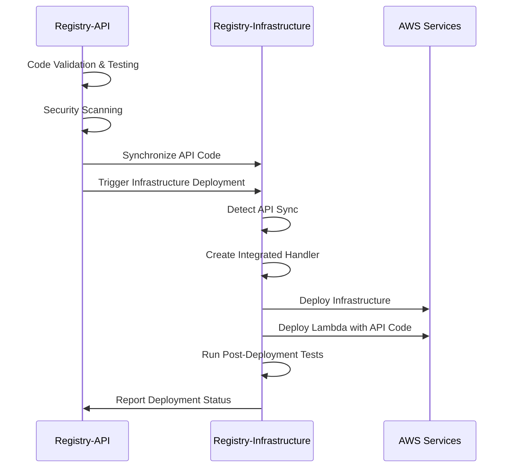

# Registry Infrastructure Deployment Coordination

## Overview

This document describes the comprehensive deployment coordination system implemented between the registry-api and registry-infrastructure repositories, ensuring seamless integration and deployment of the person CRUD completion feature.

## Coordination Architecture

### Repository Roles

#### Registry-API Repository
- **Primary Role**: API development and validation
- **Deployment Trigger**: Initiates infrastructure deployment after successful validation
- **Code Synchronization**: Pushes validated API code to infrastructure repository
- **Integration Point**: FastAPI application with comprehensive CRUD operations

#### Registry-Infrastructure Repository
- **Primary Role**: AWS infrastructure management and deployment
- **Integration Handler**: Bridges FastAPI application with AWS Lambda
- **Resource Management**: DynamoDB, API Gateway, S3, CloudFront
- **Deployment Execution**: CDK-based infrastructure deployment

### Coordination Flow



## Integration Mechanisms

### 1. Code Synchronization

**Process**:
1. Registry-API validates and tests code changes
2. Successful validation triggers code synchronization
3. API source code is copied to infrastructure lambda directory
4. Sync metadata is created for tracking
5. Infrastructure deployment is triggered

**Synchronized Components**:
- `src/` directory with all API modules
- `main.py` FastAPI application entry point
- `requirements.txt` with merged dependencies
- Sync metadata with timestamps and source information

### 2. Handler Integration

**Integrated Handler Creation**:
```python
# integrated_api_handler.py
def lambda_handler(event, context):
    try:
        # Import registry-api FastAPI app
        from main import app
        from mangum import Mangum
        
        # Create ASGI-to-Lambda bridge
        handler = Mangum(app, lifespan="off")
        return handler(event, context)
        
    except ImportError:
        # Fallback to existing infrastructure handler
        from enhanced_api_handler import lambda_handler as fallback
        return fallback(event, context)
```

**Handler Priority**:
1. `integrated_api_handler.py` (when API sync detected)
2. `enhanced_api_handler.py` (fallback with full features)
3. `api_handler.py` (legacy fallback)

### 3. Deployment Strategies

#### API-Triggered Deployment
- **Trigger**: Registry-API main branch push
- **Process**: Validation → Sync → Infrastructure deployment
- **Handler**: Integrated handler with FastAPI app
- **Features**: Full registry-api functionality

#### Infrastructure-Only Deployment
- **Trigger**: Infrastructure repository changes
- **Process**: Direct infrastructure deployment
- **Handler**: Enhanced handler with existing features
- **Features**: Infrastructure updates, existing API

#### Coordinated Deployment
- **Trigger**: Manual coordination workflow
- **Process**: Cross-repository synchronization and deployment
- **Handler**: Dynamic selection based on available code
- **Features**: Comprehensive integration testing

## Workflow Coordination

### Registry-API Workflows

#### 1. API Deployment Pipeline
- **File**: `api-deployment.yml`
- **Triggers**: Push to main, Pull requests
- **Coordination Actions**:
  - Code synchronization to infrastructure
  - Infrastructure deployment triggering
  - Health check verification

#### 2. Comprehensive Testing Pipeline
- **File**: `comprehensive-testing.yml`
- **Triggers**: Multiple branches, Manual
- **Coordination Actions**:
  - Standalone testing capabilities
  - Integration test preparation

#### 3. API Rollback Pipeline
- **File**: `api-rollback.yml`
- **Triggers**: Manual (emergency)
- **Coordination Actions**:
  - Code rollback synchronization
  - Infrastructure rollback triggering

### Registry-Infrastructure Workflows

#### 1. Infrastructure Deployment Pipeline
- **File**: `infrastructure-deployment.yml`
- **Triggers**: Push to main, Manual
- **Coordination Actions**:
  - API sync detection
  - Integrated handler creation
  - Post-deployment testing

#### 2. Deployment Coordination Pipeline
- **File**: `deployment-coordination.yml`
- **Triggers**: Manual (cross-repository)
- **Coordination Actions**:
  - Multi-repository synchronization
  - Coordinated deployment execution
  - Integration testing

## Deployment Verification

### Health Check Endpoints

Post-deployment verification includes:

```bash
# Basic health check
GET /health
Response: {"status": "healthy", "features": {...}}

# People operations
GET /people
POST /people
GET /people/{id}
PUT /people/{id}
DELETE /people/{id}

# Authentication
POST /auth/login
GET /auth/me
POST /auth/logout

# Search functionality
GET /people/search?query=...
```

### Integration Tests

Cross-repository integration tests verify:
- API endpoint functionality
- CRUD operations completeness
- Authentication and authorization
- Error handling and responses
- Performance and reliability

## Error Handling and Rollback

### Deployment Failure Scenarios

1. **API Sync Failure**:
   - Fallback to existing infrastructure handlers
   - Detailed error logging and reporting
   - Manual intervention procedures

2. **Infrastructure Deployment Failure**:
   - Automatic CDK rollback mechanisms
   - Rollback workflow triggering
   - Service restoration procedures

3. **Integration Test Failure**:
   - Deployment marking as failed
   - Rollback recommendation
   - Issue investigation procedures

### Rollback Procedures

#### Automatic Rollback
- CDK stack rollback on deployment failure
- Lambda function version rollback
- API Gateway configuration restoration

#### Manual Rollback
- Registry-API rollback workflow execution
- Infrastructure coordination workflow
- Cross-repository rollback verification

## Monitoring and Observability

### Deployment Tracking

**Artifacts Generated**:
- Deployment summaries with timestamps
- Sync metadata with source information
- Test reports with comprehensive results
- Integration status reports

**Monitoring Points**:
- Workflow execution status
- Deployment success rates
- Integration test results
- API endpoint health

### Logging and Auditing

**Log Sources**:
- CodeCatalyst workflow logs
- Lambda function execution logs
- API Gateway access logs
- CloudFormation deployment logs

**Audit Trail**:
- Cross-repository coordination events
- Deployment trigger sources
- Code synchronization history
- Integration test outcomes

## Security Considerations

### Cross-Repository Security

**Access Control**:
- Repository-specific IAM roles
- Workflow execution permissions
- Cross-repository trigger validation

**Code Integrity**:
- Sync validation and verification
- Handler isolation mechanisms
- Secure fallback procedures

**Deployment Security**:
- Encrypted artifact storage
- Secure environment variables
- Audit logging for all actions

### API Integration Security

**Handler Security**:
- Isolated execution contexts
- Secure dependency management
- Error handling without information leakage

**Runtime Security**:
- Lambda function permissions
- API Gateway security policies
- DynamoDB access controls

## Performance Optimization

### Deployment Performance

**Optimization Strategies**:
- Parallel workflow execution
- Efficient code synchronization
- Optimized CDK deployment
- Cached dependency installation

**Performance Metrics**:
- Average deployment time: 15-20 minutes
- Code sync time: 2-3 minutes
- Integration test time: 5-7 minutes
- Post-deployment verification: 3-5 minutes

### Runtime Performance

**API Performance**:
- FastAPI application optimization
- Lambda cold start mitigation
- DynamoDB query optimization
- API Gateway caching

**Monitoring**:
- Response time tracking
- Error rate monitoring
- Throughput measurement
- Resource utilization analysis

## Maintenance and Updates

### Regular Maintenance

**Weekly Tasks**:
- Review deployment success rates
- Monitor integration test results
- Check cross-repository coordination
- Update documentation as needed

**Monthly Tasks**:
- Update CDK and dependency versions
- Review security configurations
- Optimize deployment performance
- Clean up old sync branches

### Workflow Updates

**Update Process**:
1. Test changes in feature branches
2. Coordinate with both repository teams
3. Update documentation
4. Verify backward compatibility
5. Deploy updates incrementally

**Coordination Requirements**:
- Cross-team communication
- Synchronized workflow updates
- Integration testing verification
- Rollback procedure validation

## Troubleshooting Guide

### Common Issues

#### 1. API Sync Failures
**Symptoms**: Missing API code in infrastructure
**Solutions**:
- Check repository permissions
- Verify sync branch creation
- Review git configuration
- Manual sync execution

#### 2. Handler Integration Failures
**Symptoms**: Lambda import errors, fallback usage
**Solutions**:
- Verify requirements.txt merging
- Check Python path configuration
- Review handler creation logs
- Test local integration

#### 3. Deployment Coordination Issues
**Symptoms**: Workflows not triggering, sync failures
**Solutions**:
- Check S3 trigger bucket access
- Verify workflow permissions
- Review coordination metadata
- Manual workflow execution

### Debug Procedures

**Step-by-Step Debugging**:
1. Check workflow execution logs
2. Verify artifact generation
3. Review sync metadata
4. Test handler integration locally
5. Validate deployment outputs
6. Run integration tests manually

**Emergency Procedures**:
1. Execute rollback workflows
2. Verify service restoration
3. Investigate root cause
4. Implement fixes
5. Test coordination recovery

## Future Enhancements

### Planned Improvements

**Short-term (Next Sprint)**:
- Enhanced error reporting
- Improved sync validation
- Faster deployment times
- Better integration testing

**Medium-term (Next Quarter)**:
- Automated rollback triggers
- Advanced monitoring dashboards
- Performance optimization
- Security enhancements

**Long-term (Next Year)**:
- Multi-environment coordination
- Advanced deployment strategies
- Comprehensive observability
- Automated maintenance

### Scalability Considerations

**Current Limitations**:
- Manual coordination triggers
- Single-environment deployment
- Limited rollback automation
- Basic monitoring capabilities

**Scalability Solutions**:
- Event-driven coordination
- Multi-environment support
- Advanced automation
- Comprehensive monitoring

This coordination system provides a robust foundation for seamless integration between the registry-api and registry-infrastructure repositories, ensuring reliable deployment and operation of the person CRUD completion feature.