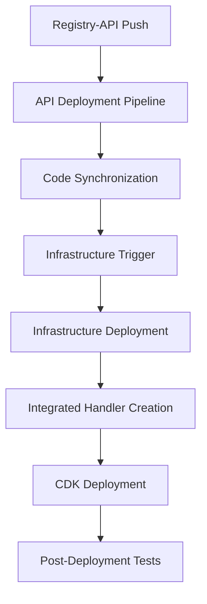

# 🏗️ Infrastructure: Add Deployment Coordination System

## 📋 Summary

This PR implements a comprehensive deployment coordination system for the registry-infrastructure repository, enabling seamless integration with the registry-api repository and automated deployment workflows.

## 🎯 Objectives

- ✅ Implement cross-repository deployment coordination
- ✅ Add API integration handlers for FastAPI applications
- ✅ Create robust deployment workflows with fallback mechanisms
- ✅ Enable automated testing and health verification
- ✅ Establish foundation for person CRUD completion feature

## 🔧 Changes Made

### New CodeCatalyst Workflows

#### 1. Infrastructure Deployment Pipeline (`infrastructure-deployment.yml`)
- **Purpose**: Main deployment pipeline with API integration support
- **Features**:
  - Automatic API sync detection
  - Dynamic handler integration (FastAPI + Lambda)
  - CDK deployment with compatibility fixes
  - Post-deployment API testing
  - Comprehensive error handling

#### 2. Deployment Coordination Pipeline (`deployment-coordination.yml`)
- **Purpose**: Cross-repository coordination and synchronization
- **Features**:
  - Multi-repository deployment trigger analysis
  - Automated code synchronization
  - Coordinated deployment execution
  - Cross-repository integration testing

#### 3. Updated Legacy Workflow (`final-working-solution.yml`)
- **Change**: Modified to manual trigger only
- **Purpose**: Backward compatibility and emergency deployments

### Handler Integration System

#### Integrated API Handler (`integrated_api_handler.py`)
- Bridges registry-api FastAPI application with AWS Lambda
- Uses Mangum for ASGI-to-Lambda adaptation
- Provides fallback to existing handlers
- Maintains security boundaries and error handling

#### Handler Priority System
1. `integrated_api_handler.py` (when API sync detected)
2. `enhanced_api_handler.py` (fallback with full features)
3. `api_handler.py` (legacy fallback)

### Documentation Updates

#### Comprehensive README (`.codecatalyst/README.md`)
- Detailed workflow documentation
- Integration architecture diagrams
- Usage instructions and troubleshooting
- Security considerations and best practices

#### Deployment Coordination Guide (`DEPLOYMENT_COORDINATION.md`)
- Cross-repository coordination architecture
- Synchronization processes and strategies
- Monitoring and observability guidelines
- Maintenance and troubleshooting procedures

## 🔄 Integration Flow

## 🧪 Testing Strategy

### Automated Testing
- CDK synthesis validation
- Lambda handler integration tests
- API endpoint health checks
- Cross-repository coordination verification

### Manual Testing Checklist
- [ ] Workflow syntax validation
- [ ] CDK deployment in test environment
- [ ] Handler integration verification
- [ ] Cross-repository permissions
- [ ] Fallback mechanism testing

## 🔒 Security Considerations

### Handler Security
- Isolated execution contexts
- Secure dependency management
- Comprehensive error handling without information leakage
- Audit logging for all coordination actions

### Cross-Repository Security
- Repository-specific IAM roles
- Workflow execution permissions
- Code integrity validation during sync
- Secure environment variable handling

## 📊 Deployment Verification

After deployment, verify these components:

### Infrastructure Resources
- [ ] Lambda functions deployed with correct handlers
- [ ] API Gateway endpoints responding
- [ ] DynamoDB tables accessible
- [ ] CloudFront distribution active

### Workflow Functionality
- [ ] Infrastructure deployment pipeline executes
- [ ] API sync detection works correctly
- [ ] Handler integration functions properly
- [ ] Post-deployment tests pass

### Integration Points
- [ ] Cross-repository coordination active
- [ ] Sync metadata creation working
- [ ] Fallback mechanisms functional
- [ ] Error handling and logging operational

## 🚨 Rollback Plan

If issues occur after deployment:

1. **Immediate**: Use manual trigger on legacy workflow
2. **Handler Issues**: Automatic fallback to enhanced_api_handler
3. **Workflow Issues**: Disable new workflows, use existing ones
4. **Complete Rollback**: Revert PR and redeploy previous version

## 📈 Performance Impact

### Expected Improvements
- Faster deployment coordination (15-20 minutes total)
- Automated integration testing
- Reduced manual intervention
- Better error handling and recovery

### Resource Usage
- Additional Lambda execution time for integrated handlers
- Increased CodeCatalyst workflow minutes
- S3 storage for coordination artifacts
- CloudWatch logs for enhanced monitoring

## 🔗 Dependencies

### Prerequisites
- AWS CDK 2.80.0 compatibility
- Python 3.9 Lambda runtime
- CodeCatalyst workflow permissions
- Cross-repository access configured

### Related Changes
- **Registry-API**: Will implement deployment workflows that trigger this system
- **Registry-Frontend**: Will benefit from coordinated deployments

## 📝 Migration Notes

### For Development Teams
- New workflows will be available after merge
- Existing deployment processes remain functional
- Manual coordination available as fallback
- Monitor CodeCatalyst console for execution status

### For Operations Teams
- Enhanced monitoring through comprehensive logging
- Automated health checks and verification
- Rollback mechanisms ready for emergency use
- Cross-repository coordination reduces manual steps

## ✅ Checklist

### Pre-Merge Validation
- [ ] All workflow YAML files have valid syntax
- [ ] CDK synthesis passes locally
- [ ] Handler integration code reviewed
- [ ] Documentation is comprehensive and accurate
- [ ] Security considerations addressed
- [ ] Rollback procedures documented

### Post-Merge Verification
- [ ] New workflows appear in CodeCatalyst console
- [ ] No immediate execution errors
- [ ] Legacy workflows still functional
- [ ] Infrastructure resources unchanged
- [ ] Monitoring and logging active

## 🎉 Expected Outcomes

After successful deployment:

1. **Enhanced Coordination**: Seamless integration with registry-api deployments
2. **Automated Testing**: Comprehensive post-deployment verification
3. **Improved Reliability**: Robust error handling and fallback mechanisms
4. **Better Monitoring**: Detailed logging and status reporting
5. **Foundation Ready**: Infrastructure prepared for person CRUD completion

## 📞 Support

### Immediate Issues
- Check CodeCatalyst workflow execution logs
- Review CloudFormation stack events
- Verify IAM permissions and connections
- Use manual coordination as fallback

### Team Contacts
- **DevOps**: Monitor deployment execution
- **Backend Team**: Coordinate with registry-api integration
- **Frontend Team**: Prepare for coordinated deployments

---

**This PR establishes the foundation for automated, coordinated deployments across all repositories while maintaining backward compatibility and providing robust fallback mechanisms.**