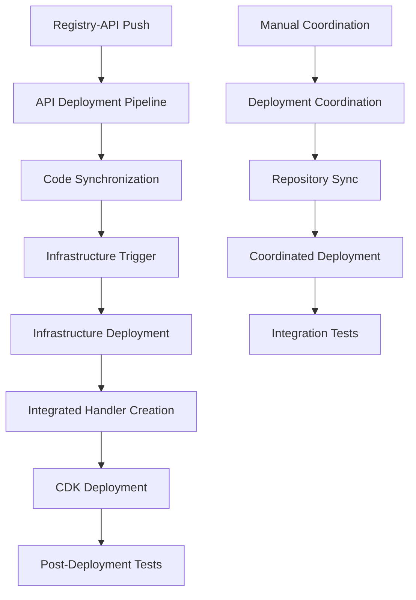

# Registry Infrastructure CodeCatalyst Workflows

This directory contains comprehensive CodeCatalyst workflows for the registry-infrastructure repository, designed to coordinate with the registry-api repository for seamless deployment and integration.

## Workflows Overview

### 1. Infrastructure Deployment Pipeline (`infrastructure-deployment.yml`)

**Purpose**: Main infrastructure deployment pipeline with API integration support

**Triggers**:
- Push to `main` branch
- Manual trigger

**Actions**:
1. **CheckAPISync**: Detects if deployment includes synchronized API code from registry-api
2. **PrepareAPIIntegration**: Creates integrated handlers for registry-api FastAPI application
3. **ValidateInfrastructure**: CDK validation and compatibility checks
4. **DeployInfrastructure**: AWS CDK deployment with integrated API handlers
5. **PostDeploymentTests**: Comprehensive API endpoint testing
6. **NotifyDeploymentStatus**: Deployment completion notifications

**Key Features**:
- ✅ Automatic detection of API code synchronization
- 🔧 Dynamic handler integration (FastAPI + Lambda)
- 🧪 Post-deployment API testing
- 📊 Comprehensive deployment reporting

### 2. Deployment Coordination Pipeline (`deployment-coordination.yml`)

**Purpose**: Cross-repository deployment coordination and synchronization

**Triggers**:
- Manual trigger (typically called by registry-api workflows)

**Actions**:
1. **CheckDeploymentTriggers**: Analyzes deployment triggers from multiple sources
2. **SynchronizeRepositories**: Coordinates code sync between repositories
3. **CoordinatedDeployment**: Executes deployment with proper integration
4. **IntegrationTests**: Cross-repository integration testing

**Key Features**:
- 🔄 Cross-repository coordination
- 📥 Automatic API code synchronization
- 🧪 Integration testing across repositories
- 📋 Deployment strategy determination

### 3. Legacy Final Working Solution (`final-working-solution.yml`)

**Purpose**: Legacy deployment workflow (manual trigger only)

**Status**: Maintained for backward compatibility, use new workflows for active development

## Integration Architecture

### API Integration Flow



### Handler Integration Strategy

The infrastructure supports multiple handler integration patterns:

1. **Integrated Handler** (`integrated_api_handler.py`):
   - Primary handler when API sync is detected
   - Bridges registry-api FastAPI app with Lambda
   - Uses Mangum for ASGI-to-Lambda adaptation

2. **Enhanced Handler** (`enhanced_api_handler.py`):
   - Fallback handler with comprehensive features
   - Session management and security hardening
   - Direct Lambda implementation

3. **Auth Handler** (`auth_handler.py`):
   - Dedicated authentication operations
   - JWT token management
   - User profile operations

## Cross-Repository Coordination

### Synchronization Process

1. **Trigger Detection**: Infrastructure workflows detect API deployment triggers
2. **Code Synchronization**: API code is synchronized to `lambda/` directory
3. **Handler Integration**: Integrated handlers are created dynamically
4. **Requirements Merging**: Dependencies are merged for compatibility
5. **Deployment Execution**: CDK deploys with integrated components
6. **Verification**: Post-deployment tests verify integration

### Synchronized Components

- **API Source Code**: `registry-api/src/` → `lambda/src/`
- **FastAPI Application**: `registry-api/main.py` → `lambda/main.py`
- **Dependencies**: Merged requirements.txt
- **Metadata**: Sync timestamps and source information

## Deployment Strategies

### 1. API-Triggered Deployment
- **Trigger**: Registry-API code synchronization
- **Handler**: `integrated_api_handler.py`
- **Features**: Full FastAPI integration, registry-api endpoints

### 2. Infrastructure-Only Deployment
- **Trigger**: Infrastructure code changes
- **Handler**: `enhanced_api_handler.py`
- **Features**: Infrastructure updates, existing API functionality

### 3. Coordinated Deployment
- **Trigger**: Manual coordination workflow
- **Handler**: Dynamic selection based on available code
- **Features**: Cross-repository testing, comprehensive integration

### 4. Manual Deployment
- **Trigger**: Manual workflow execution
- **Handler**: Based on current repository state
- **Features**: On-demand deployment, troubleshooting

## Environment Configuration

### AWS Resources Deployed

- **API Gateway**: RESTful API endpoints
- **Lambda Functions**: 
  - Main API handler (integrated or enhanced)
  - Authentication handler
- **DynamoDB Tables**: 
  - People, Projects, Subscriptions
  - Password management, Email tracking
  - Audit logs, Session tracking
  - Rate limiting, CSRF tokens
- **S3 + CloudFront**: Frontend hosting
- **IAM Roles**: Lambda execution permissions

### Environment Variables

```bash
# DynamoDB Tables
PEOPLE_TABLE_NAME=PeopleTable
PROJECTS_TABLE_NAME=ProjectsTable
SUBSCRIPTIONS_TABLE_NAME=SubscriptionsTable
PASSWORD_RESET_TOKENS_TABLE_NAME=PasswordResetTokensTable
AUDIT_LOGS_TABLE_NAME=AuditLogsTable
EMAIL_TRACKING_TABLE=EmailTrackingTable
PASSWORD_HISTORY_TABLE=PasswordHistoryTable
SESSION_TRACKING_TABLE=SessionTrackingTable
RATE_LIMIT_TABLE_NAME=RateLimitTable
CSRF_TOKEN_TABLE_NAME=CSRFTokenTable

# Security Configuration
JWT_SECRET=your-jwt-secret-change-in-production-please
JWT_EXPIRATION_HOURS=24
CSRF_SECRET=production-csrf-secret-change-this-value

# Email Configuration
SES_FROM_EMAIL=noreply@people-register.local
FRONTEND_URL=https://d28z2il3z2vmpc.cloudfront.net
```

## Usage Instructions

### Automatic Deployment (Recommended)

1. **API Changes**: Push to registry-api main branch
   - Triggers API deployment pipeline
   - Automatically synchronizes code to infrastructure
   - Triggers infrastructure deployment with integration

2. **Infrastructure Changes**: Push to registry-infrastructure main branch
   - Triggers infrastructure deployment pipeline
   - Uses existing or synchronized API code
   - Deploys infrastructure updates

### Manual Coordination

1. Navigate to CodeCatalyst console
2. Select "Deployment_Coordination_Pipeline"
3. Click "Run workflow"
4. Monitor cross-repository coordination

### Manual Infrastructure Deployment

1. Navigate to CodeCatalyst console
2. Select "Infrastructure_Deployment_Pipeline"
3. Click "Run workflow"
4. Monitor deployment progress

## Monitoring and Troubleshooting

### Deployment Verification

After deployment, verify these endpoints:
- `GET /health` - Basic health check
- `GET /people` - People list endpoint
- `POST /people` - Person creation
- `GET /auth/me` - Authentication check

### Common Issues

1. **API Integration Failures**:
   - Check sync metadata in `lambda/sync-metadata.json`
   - Verify integrated handler creation
   - Review Lambda logs for import errors

2. **CDK Deployment Failures**:
   - Check Lambda runtime compatibility (Python 3.9)
   - Verify CDK version (2.80.0)
   - Review CloudFormation stack events

3. **Cross-Repository Sync Issues**:
   - Verify S3 trigger bucket access
   - Check git repository permissions
   - Review sync branch creation

### Debug Resources

- **CloudWatch Logs**: Lambda function execution logs
- **CloudFormation**: Stack deployment events
- **CodeCatalyst**: Workflow execution logs and artifacts
- **API Gateway**: Request/response logs and metrics

## Artifacts Generated

### Infrastructure Deployment
- `deploymentContext`: Deployment type and sync detection
- `apiIntegration`: Integration summary and handlers
- `deploymentSummary`: Deployment results and outputs
- `testReport`: Post-deployment test results
- `deploymentNotification`: Completion notifications

### Deployment Coordination
- `coordinationPlan`: Cross-repository coordination strategy
- `syncSummary`: Repository synchronization results
- `coordinatedDeploymentResult`: Coordinated deployment outcomes
- `integrationTestReport`: Cross-repository test results

## Security Considerations

### API Integration Security
- **Handler Isolation**: Integrated handlers maintain security boundaries
- **Dependency Management**: Careful merging of requirements
- **Error Handling**: Secure fallback mechanisms
- **Logging**: Comprehensive audit trails

### Cross-Repository Security
- **Access Control**: Repository-specific permissions
- **Sync Validation**: Code integrity verification
- **Deployment Isolation**: Separate deployment contexts
- **Audit Logging**: Cross-repository action tracking

## Maintenance

### Regular Tasks
- Monitor deployment success rates
- Review integration test results
- Update CDK and dependency versions
- Verify cross-repository coordination
- Clean up old sync branches

### Workflow Updates
- Test changes in feature branches
- Coordinate updates with registry-api team
- Update documentation for new features
- Verify backward compatibility

This infrastructure provides a robust, coordinated deployment system that seamlessly integrates with the registry-api repository while maintaining flexibility and reliability.